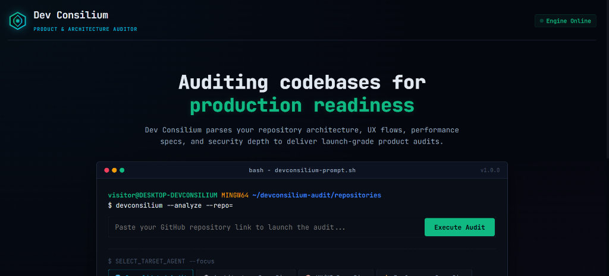
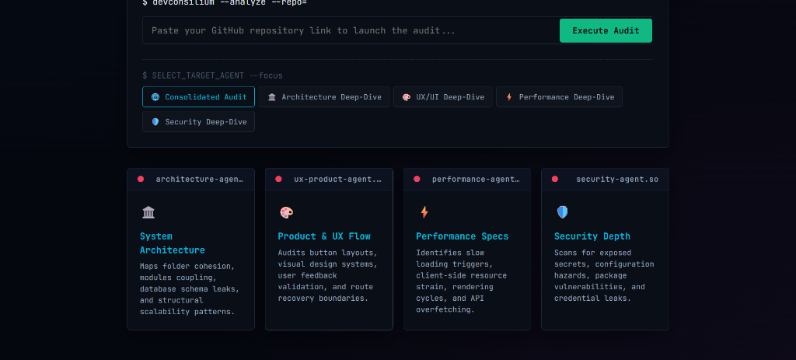
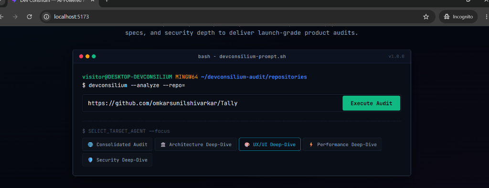
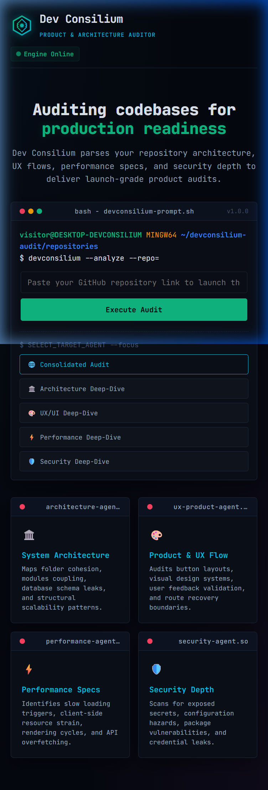
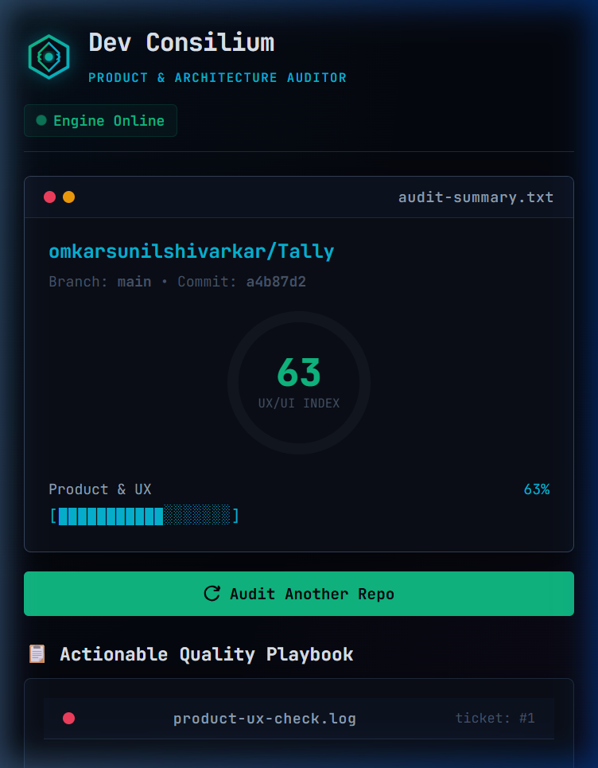

# Dev Consilium — AI-Powered Product & Architecture Auditor

Dev Consilium is a modern web application designed to run high-fidelity static audits on GitHub repositories using specialized AI agents. It leverages a responsive TUI-themed (Terminal User Interface) frontend and a Node.js/Express backend integrated with Groq LLM API.

---

## 📸 App Previews

### Desktop Views

| Landing & Audit Settings | Real-Time Agent Scan | Analysis Dashboard |
| --- | --- | --- |
|  |  |  |

### Mobile Views

| Mobile Landing | Mobile Dashboard |
| --- | --- |
|  |  |

---

## 🚀 Key Features

* **Consolidated & Deep-Dive Scopes:** Focus your repository analysis on specific layers:
  * 🌐 **Consolidated Audit:** Orchestrates all sub-agents for a full-scale review.
  * 🏛️ **Architecture Deep-Dive:** Evaluates folder layering, module coupling, and structural debt.
  * 🎨 **UX/UI Deep-Dive:** Assesses layout responsiveness, spacing consistency, and loading states.
  * ⚡ **Performance Deep-Dive:** Detects heavy dependencies, bundle weight bloat, and render bottlenecks.
  * 🛡️ **Security Deep-Dive:** Audits secrets leakage, exposed environment files, and vulnerabilities.
* **TUI Console Stream:** A styled log console simulating real-time agent debates and repo checking.
* **Dashboard Report:** Displays interactive radial index gauges and progress bars.
* **Actionable Quality Playbook:** Ticket cards containing specialized critiques, priority level markers, and file references.
* **Responsive Layout:** Stacks and scales perfectly across desktops, tablets, and small mobile screens.

---

## 🛠️ Project Structure

* **`backend/`** (Node.js & Express API Server)
  * `server.js` - Server initialization and endpoints orchestration.
  * `services/gitService.js` - Clones repository trees and extracts configuration manifests.
  * `services/llmService.js` - Configures LLM system prompt templates and structured JSON guidelines.
* **`src/`** (React + Vite Client)
  * `App.jsx` - Core routing, view manager, and state container.
  * `index.css` - Custom styling tokens, themes, and animations.
  * `components/Landing.jsx` - Terminal command input and audit selector.
  * `components/Scanning.jsx` - Simulated live console audit feed.
  * `components/Dashboard.jsx` - Summary cards, radial gauges, and action layout.
  * `components/Playbook.jsx` - Quality playbook ticket listing.

---

## ⚙️ Installation & Local Setup

### 1. Backend Server Setup
Navigate to the backend directory, install dependencies, and configure the Groq API key:
```bash
cd backend
npm install
```

Create a `.env` file in the `backend/` directory:
```env
PORT=3000
GROQ_API_KEY=your_groq_api_key_here
```

Start the backend server:
```bash
npm run start
```
The server will run on `http://localhost:3000`.

### 2. Frontend Client Setup
From the project root directory, install dependencies and launch the Vite development server:
```bash
npm install
npm run dev
```
Open `http://localhost:5173` in your browser.
